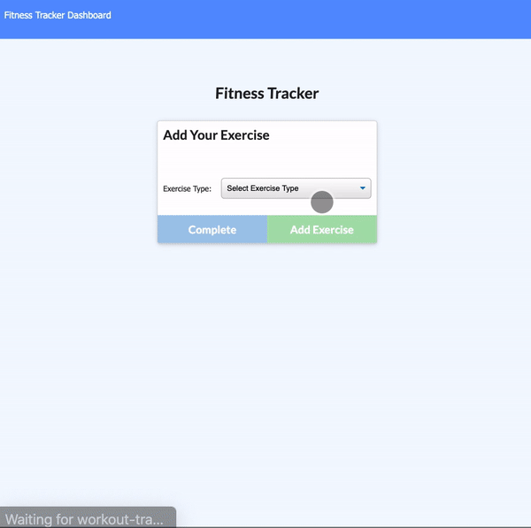

# NoSQL Workout Tracker

## Description
This is a workout tracker where the user can continue previous workouts by adding additional exercises or create new workouts.  

[View the Heroku deployed site here.](https://workout-tracker0.herokuapp.com/)

## Getting Started

Open the deployed page and click whether you would like to add or continue the exercise.

Select whether you are adding a Cardio or Resitance exercise.

Fill in the form based off previous selection.

Add to workout if you would like to add another exercise or complete the workout if you would only like to add the one exercise.

View the dashboard to see stats based off the exercises entered.

## User Story

* As a user, I want to be able to view create and track daily workouts. I want to be able to log multiple exercises in a workout on a given day. I should also be able to track the name, type, weight, sets, reps, and duration of exercise. If the exercise is a cardio exercise, I should be able to track my distance traveled.

## Built With
* Mongoose
* Node.js & Express.js
* HTML, CSS, Javascript

#### License
MIT License Copyright (c) 2020 Taylor Bruno